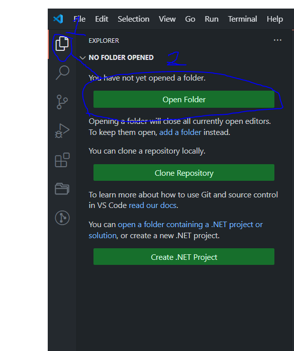
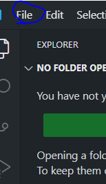
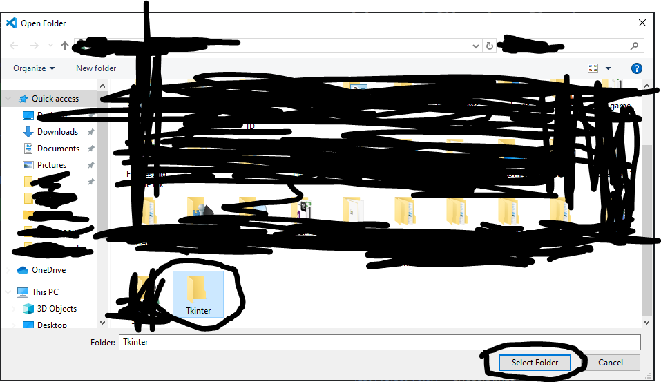

# Getting Started

## What is Tkinter?

Tkinter is a Python library that provides a simple and efficient way to create graphical user interfaces (GUIs). It's included with most Python installations, making it easily accessible for developers who want to build desktop applications without requiring additional installations or libraries.   

## Key Features of Tkinter:

> Simple and Easy to Learn: Tkinter has a straightforward syntax and a wide range of widgets (buttons, labels, text boxes, etc.) that can be easily combined to create various user interfaces.   

> Cross-Platform Compatibility: Tkinter applications can run on Windows, macOS, and Linux, making it a versatile choice for developers.   

> Wide Range of Widgets: Tkinter provides a variety of widgets to build interactive and visually appealing interfaces, including buttons, labels, text boxes, menus, and more.   

> Customization Options: You can customize the appearance and behavior of Tkinter widgets using various attributes and methods.   

> Event Handling: Tkinter allows you to handle user interactions with the GUI, such as button clicks, mouse movements, and keyboard input.

## Common Use Cases:

> Desktop Applications: Building simple desktop applications like calculators, to-do lists, and file explorers.   

> Prototyping: Quickly prototyping user interfaces for web or mobile applications.   

>Educational Tools: Creating interactive learning tools and simulations.

>Data Visualization: Developing simple data visualization tools.

## What is Tkinter-For-Noobs?

Tkinter For Noobs is a begginers course to Tkinter made by Max_Dev with 5+ years of Python experience & more!
This Basic Course includes 10 easy Tkinter projects to get you started.

## Requirements

> Must have Python Installed and be on the latest version. If you havent click [HERE](https://www.python.org/downloads/)

> Must have at least have Basic python knokledege

> Must Have Visual Studio Code installed. If you havent click [HERE](https://code.visualstudio.com/)

## Setup

> Open Visual Studio Code

> Open a New Folder

Or 

##
> Create a new foler named **Tkinter** and Open IT

## Downloading Tkinter Libary

> Go to the terminal

Or

> Use `CTRL +  (backtick)`

##

> Then inside the terminal window do this command: `pip install tk`

> [!CAUTION]
> Do not execute CODE that your sceptical of.

## Links

> [Python Docs](https://docs.python.org/3/)
> [Visual Studio Docs](https://code.visualstudio.com/docs)

# END OF FILE MADE BY MAX
